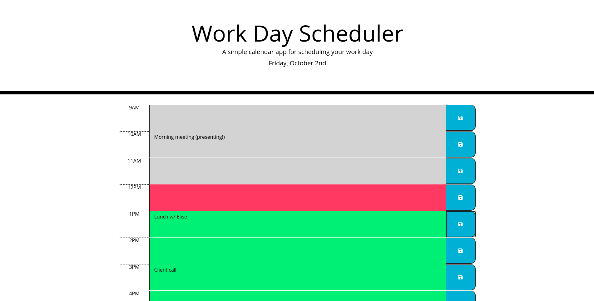

[Work Day Scheduler](https://periodicaidan.github.io/work-day-scheduler)
===

A rudimentary day-planner, allowing one to add and edit events to an hourly schedule and have those events persist across page loads.

## Features

- Add and edit hourly events for a 9-5 workday
- Save events in the browser to persist across page loads
- Color-coded to distinguish events for the current hour, along with past and future events 